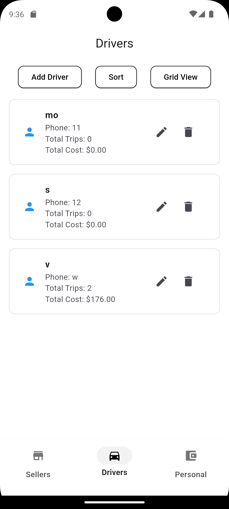
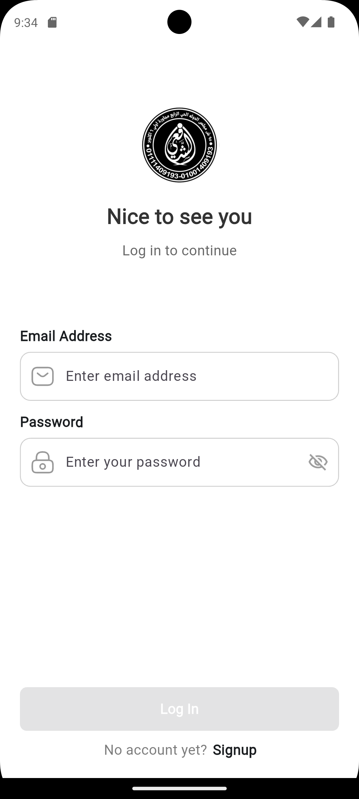
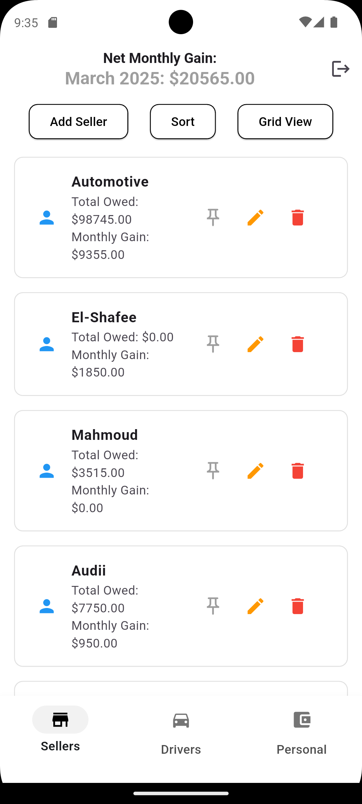
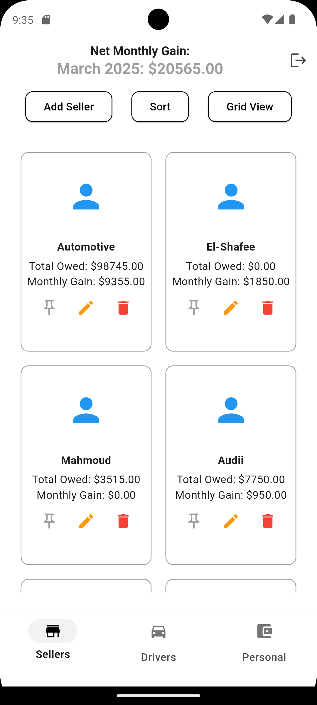
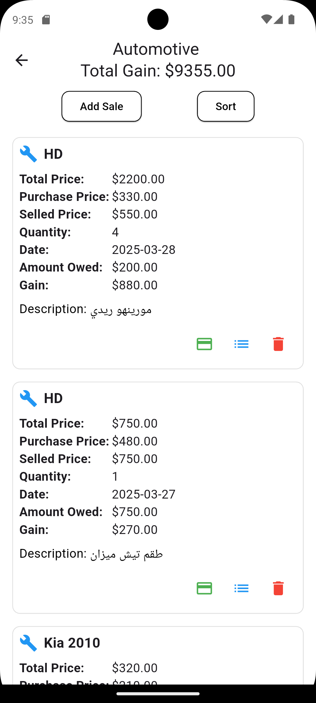

# CarPart Store Management App

A Flutter app for managing car parts stores, sales, driver trips, and seller finances. Built with **Clean Architecture**, **Firebase Auth**, and **Firestore**.

---
## App Screenshots

| Screen 1 | Screen 2 | Screen 3 |
|----------|----------|----------|
|  |  |  |

| Screen 4 | Screen 5 | Screen 6 |
|----------|----------|----------|
|  |  |  |

## Features
- **User Roles**:
  - **Sellers**: Manage inventory, track sales, view net worth, and monitor driver trips.
  - **Sales Team**: Process transactions and update stock.
- **Auth**: Firebase Authentication (Email/Password, Google).
- **Financial Tracking**:
  - Personal funds tracking for sellers.
  - Monthly net worth reports.
- **Driver Trips**: Assign trips, track delivery status, and calculate fuel costs.
- **Inventory Management**: CRUD operations for car parts (name, price, quantity, SKU).
- **Sales Dashboard**: Visualize sales trends and revenue.

---

## Tech Stack
- **Flutter**: 3.16+ (Dart 3.2+)
- **Firebase**: 
  - Authentication
  - Firestore (NoSQL Database)
- **State Management**: BLoC/Cubit
- **Packages**:
  - `equatable`, `flutter_bloc`, `intl`, `cloud_firestore`, `firebase_auth`, `Firebase_auth`

---

## Clean Architecture Structure
lib/
├── core/
│ ├── constants/ # App-wide constants
│ ├── errors/ # Custom exceptions
│ └── utils/ # Shared utilities
├── data/
│ ├── datasources/ # Firebase APIs (Auth, Firestore)
│ ├── models/ # Firestore data models
│ └── repositories/ # Implementations of domain repos
├── domain/
│ ├── entities/ # Business logic entities
│ ├── repositories/ # Abstract repo contracts
│ └── usecases/ # Business logic operations
└── presentation/
├── blocs/ # BLoCs/Cubits
├── pages/ # Screens (Seller, Sales, Trips)
└── widgets/ # Reusable UI components

git clone https://github.com/senkop/elshaf3y_store
flutter pub get
flutter run
